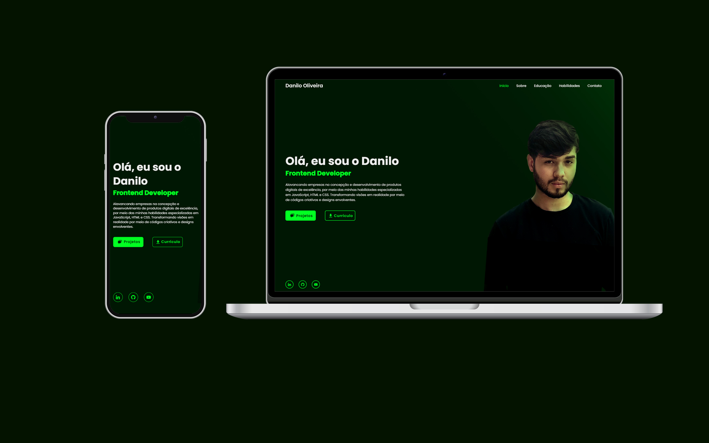

<h1 align="center">Portfólio</h1>

  

  

## 💻 Projeto

Meu Portfólio de Trabalho: Revelando minha jornada e motivações como Desenvolvedor Web.

- [Acesse o projeto](https://danilooliveira.vercel.app/)

## 🚀 Tecnologias

Esse projeto foi desenvolvido com as seguintes tecnologias:

- HTML e CSS
- JavaScript
- Git e Github
- Photoshop
